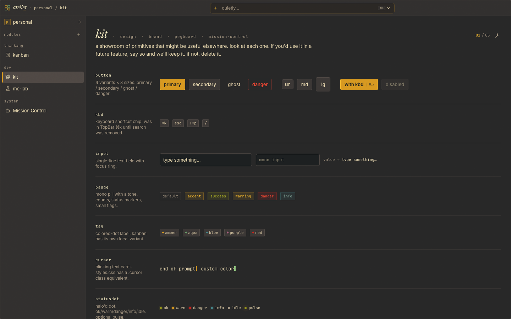

# Kit

A living showroom for the visual language of [Atelier](https://github.com/pA1nD/atelier). Five pages — primitives, design tokens, brand, the empty state, the agent bar — each rendered live from the source. The rules are visible and playable, not written down somewhere and quietly drifting.



## Why

Atelier's rule: *every module owns its UI*. There is no shared component library — modules write their own buttons, inputs, icons. Kit is the gallery where forward-looking primitives wait for a second consumer. If a primitive earns its keep, you copy it into the module that wants it. If not, you delete it.

The other pages apply the same idea to the system itself: read from the canonical tokens, render them visually so deviations are easy to spot — and play with them until the rules feel real.

## Pages

- **kit** — primitives that *might* be useful elsewhere. Look, decide, promote or cull. Currently: `Button`, `Kbd`, `Input`, `Badge`, `Tag`, `Cursor`, `StatusDot`, `Spinner`, `Sparkline`, `Ring`, `Bar`, `AgentChip`.
- **design** — surfaces, foregrounds, brand accents, signals, type, radii, spacing, motion. Live from CSS custom properties — change a token in `atelier/styles.css` and the swatches follow.
- **brand** — the mark, the wordmark, the tagline, the voice. Full icon suite, in-context mockups, and a *favicon mood ring* that swaps the live tab icon while you watch.
- **pegboard** — Atelier's empty-state dot field, taken seriously. A live canvas with six narrative effects (dots gathering into letterforms, a radial wave, a 3D Fibonacci sphere…) framed by hand-placed italic margin notes — *the silence between the dots is the design*. Click *draw an arrow* and the page becomes a sketchpad.
- **mission-control** — sandbox for the global agent bar. Every state and density side-by-side with mock data, so visuals can be iterated here before they're copied into the real `mission-control/` module.

Navigation is the title: the active tab renders as italic Newsreader 34px, the rest as small mono caps on the same baseline. `←` / `→` navigate. Page transitions use the View Transitions API where available.

## Use

Clone next to `atelier/` — the shell auto-discovers any sibling directory with a `frontend.jsx` (see [Atelier's module convention](https://github.com/pA1nD/atelier#module-convention)). The directory name has to be `kit/` because the module id and URL path are derived from it:

```
git clone git@github.com:pA1nD/atelier-kit.git kit
```

Then, from the workspace root:

```
npm run dev                       # dev, http://localhost:5172/kit
npm run atelier -- install kit    # ship to the installed agent (macOS)
```

Single `frontend.jsx`. No backend, no build step, no `package.json`.
